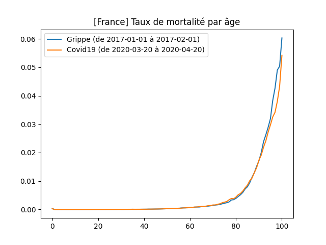
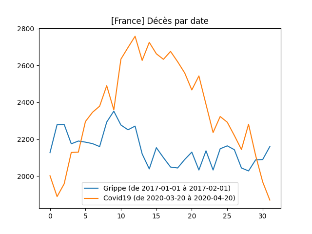
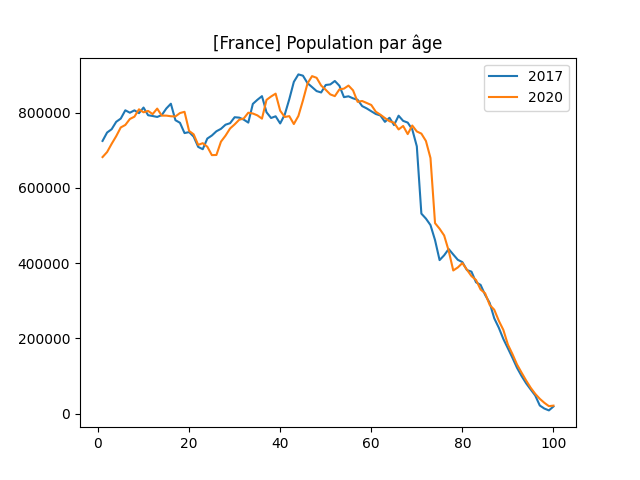
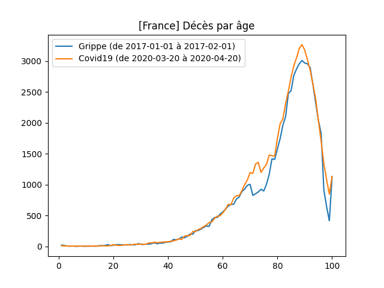
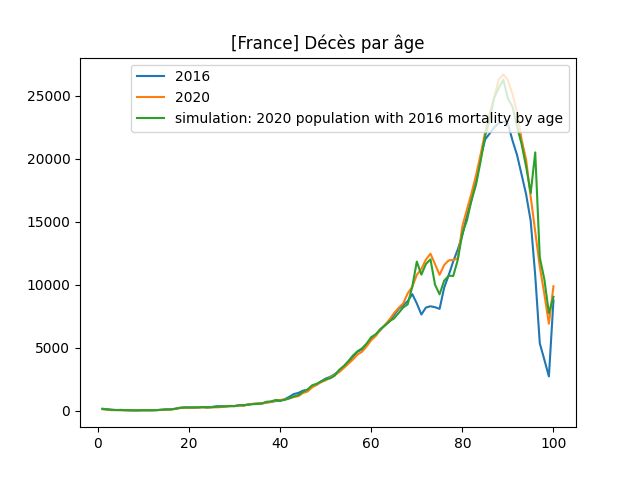
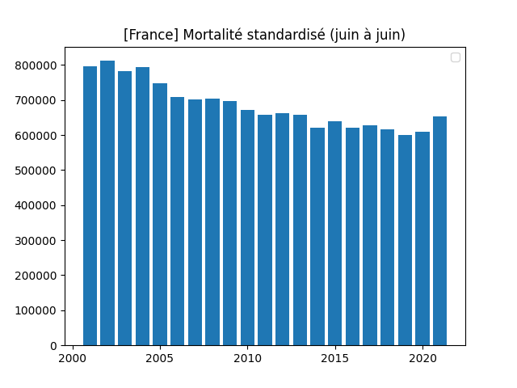
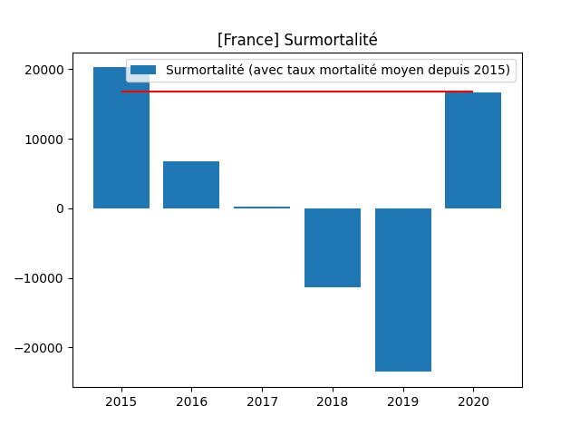
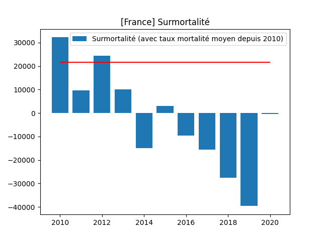

# c19frcheck

Programme visant à calculer le taux de mortalité de la Covid19 en France et de le comparer aux épidémies (de grippe) d'autres années.

Les données sont récupérées automatiquement par le programme depuis des sources officielles.

# Résultats: 1ier pic covid (mars/avril 2020) VS Grippe janvier 2017

On peut constater sur le graphe suivant que la première vague de Covid19 en France a un taux de mortalité légèrement plus faible que l'épisode de grippe de janvier 2017:



Pourtant le nombre total de décès est supérieur pour la Covid19:



Cette apparente différence s'explique par le fait que nous connaissons actuellement en France un vieillissement rapide de la population (phénomène connu sous le nom de "Papy Boom"). Le nombre de personnes autour de 75 ans est en rapide augmentation, or cette tranche de la population est parmi celle qui est la plus vulnérable aux épidémies hivernales.



Ainsi, l'excés de mortalité que nous avons connu lors de la première vague de Covid19 s'explique non pas par la gravité du virus, qui au final semble n'avoir rien d'inhabituelle, mais simplement par le vieillisement rapide la population.

On peut en effet constater que les âges dans lesquels le Covid19 a tué plus que la grippe de janvier 2017, sont les mêmes âges oú la population est plus nombreuse en 2020 qu'en 2017.



# Résultats: 2016 VS 2020

Pour confirmer l'impact de la pyramide des âges sur la surmortalité en 2020, on peut essayer d'appliquer le taux de mortalité par âge d'une année à forte grippe (2016) à la pyramide des âges de 2020 (courbe verte).

On "comble" ainsi les différences de mortalité entre 2016 (bleu) et 2020 (orange), et ce pile aux âges où justement il y avait une différence.

Ce qui semble confirmer que la surmortalité 2020 s'explique en très grande partie par une plus grande population de personnes âgées en 2020.

Ces différences de population peuvent s'expliquer par:
- Le papy boom (autour de 65 ans)
- Des grippes 2018 et 2019 peu mortelles (85 ans et +)



# Résultats: Taux de mortalité standardisés annuels de 2000 à 2020

On peut constater que la mortalité de l'année 2020 (1ière année du Covid19) est certes un peu plus élevée que l'année précédente (2019), mais reste tout à fait dans les normes des taux de mortalité de ces 20 dernières années. Ce qui suggère que le Covid19 ne constitue aucunement un épisode épidémique exceptionnel.

(Ici, la mortalité est standardisé par âge, ce qui permet de ne pas perturber les résultats comparatifs par le viellissement de la population).


Même résultats avec des années comptées de juin à juin (ici jusqu'à juin 2021)



# Résultats: Surmortalité 2020

On nous présente le covid comme ayant provoqué plus de 110k morts en France. Mais par ce chiffre nous ne savons rien de l'âge de ces morts, de leur état de santé, ni de si ils seraient morts ou non sans le covid.

Pour savoir cela, on peut estimer la surmortalité en 2020 en comparant la mortalité réelle avec une estimation basée sur un taux de mortalité par âge constant.

Si pour ce taux de mortalité constant on prend une moyenne de 2015 à 2019, on voit que la surmortalité 2020 ne dépasse pas la déviantion standard (environ 15k morts). Ce qui la encore ne suggère rien d'exceptionnel concernant la mortalité du covid.



Si pour ce taux de mortalité constant on prend une moyenne de 2010 à 2019, la surmortalité 2020 est très proche de 0.



# Prévision de mortalité

Ici une simulation de la mortalité par année, de 2010 à 2050, a été réalisée, et comparée à la mortalité réelle observée.

Cette simulation a été réalisée avec une mortalité par âge constante (moyenne entre 2010 et 2019), et en faisant évoluer la pyramide des âges.


On peut constater que:
* Le vieillissement de la population entraine une hausse de la mortalité depuis au moins 10 ans.
* Cette hausse devrait continuer jusqu'en 2040.
* La mortalité en 2020 semble rattraper un mimimum local.

Selon ces résultats, et si l'on considère raisonnable l'hypothèse que l'occupation des réanimations soit corrélée à la mortalité, on peut s'attendre à ce que la saturation des hopitaux (qui en 2020 a été la justification des mesures de distanciations sociales et de confinements) continue de s'empirer, non pas du fait d'un virus particulier, mais simplement du fait du vieillissement de la population.

# Autres pays

* [Suède](./README_se.md)

# Infos complémentaires

* [Chaine Youtube "Décoder l'éco"](https://www.youtube.com/watch?v=8pA9pfFUSIk)

# Comment executer

```
# need python3
pip install -r requirements.txt
run.py all
```