## Autriche

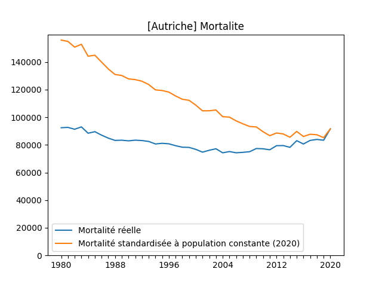

## Azerbaïdjan

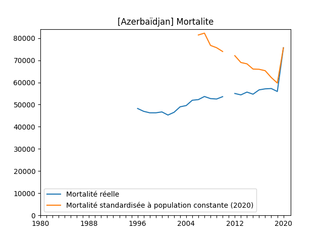

## Bulgaria

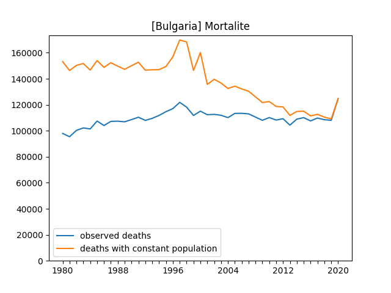

## Suisse

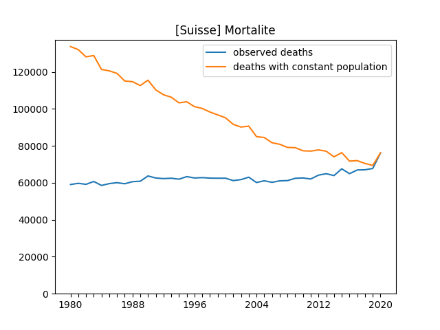

## Tchéquie

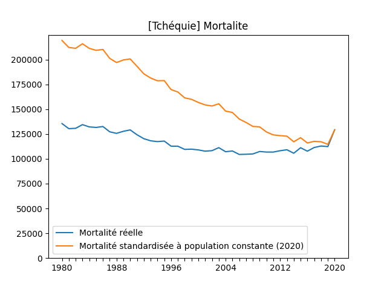

## Allemagne

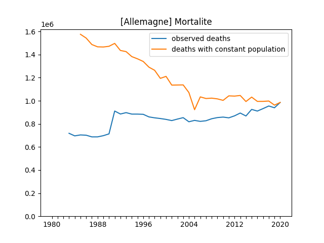

## Danemark

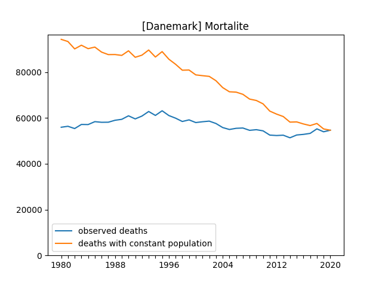

## Espagne

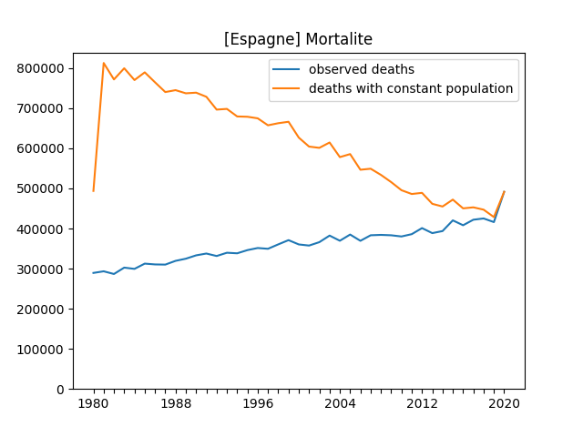

## France

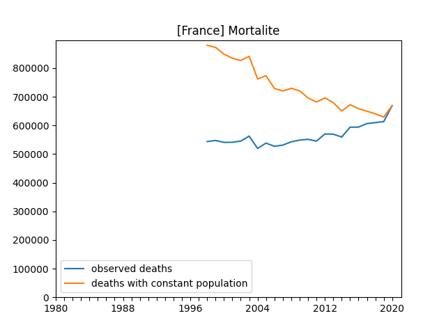

## Finlande

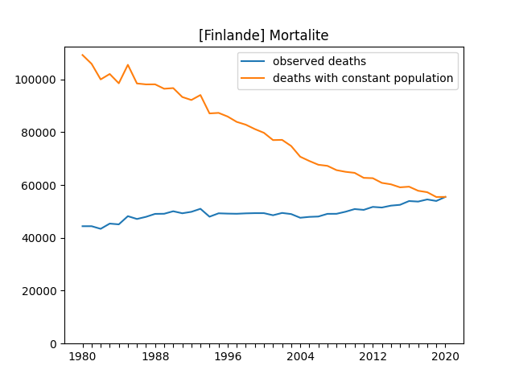

## Croatie

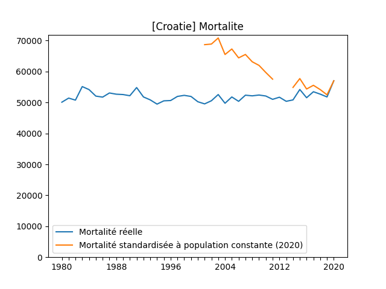

## Hongrie

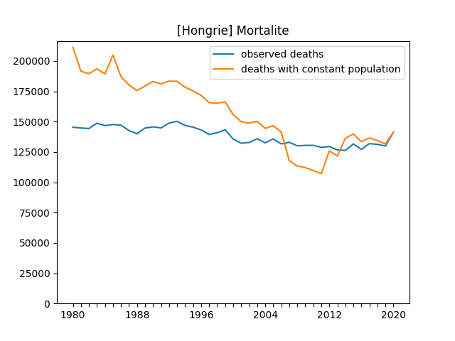

## Irlande

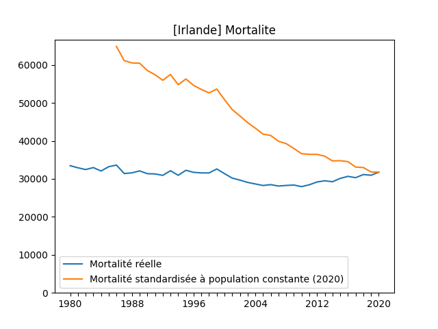

## Italie

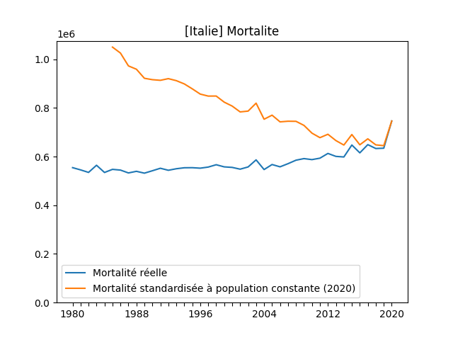

## Lituanie

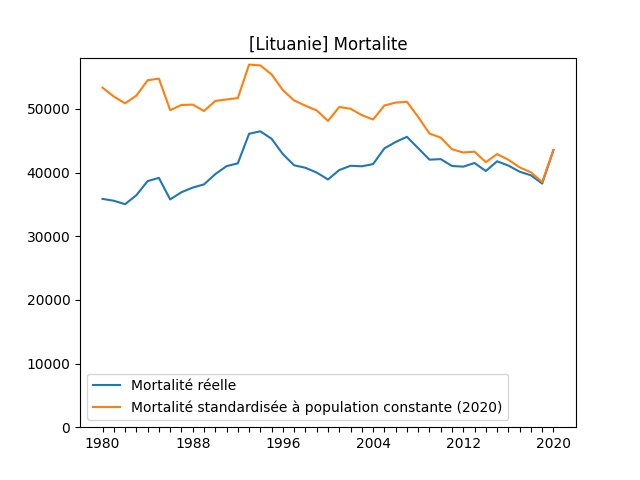

## Lettonie

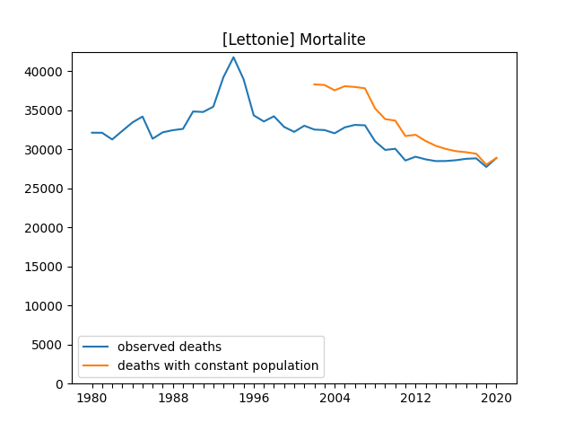

## Macédoine du Nord

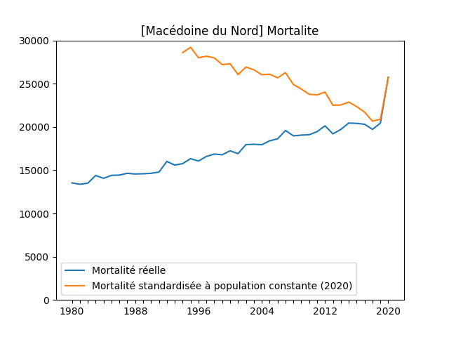

## Pays-Bas

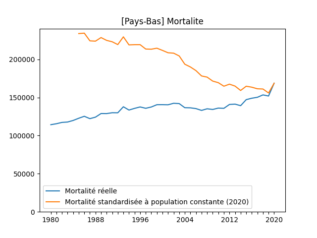

## Norvège

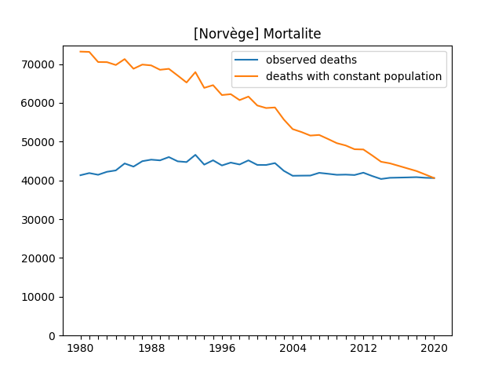

## Pologne

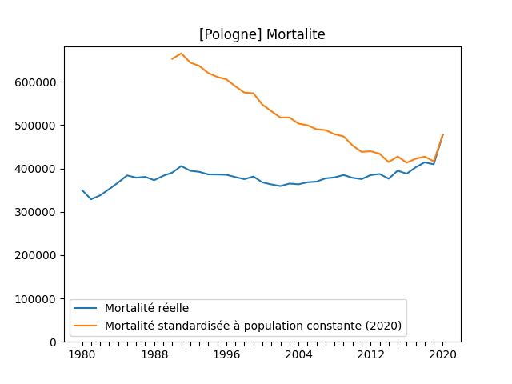

## Portugal

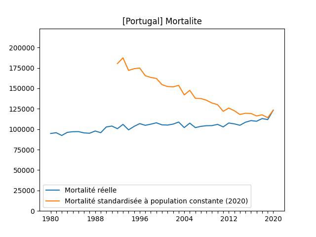

## Roumanie

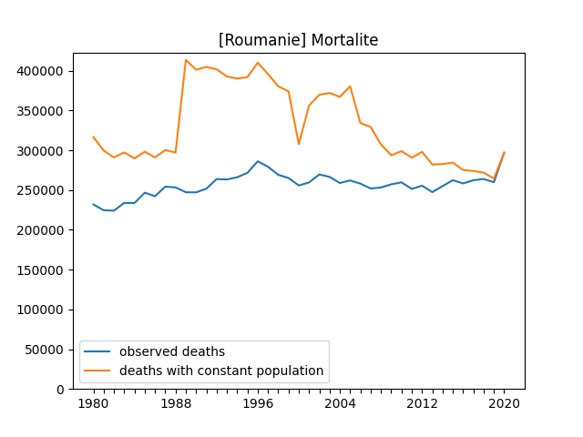

## Serbie

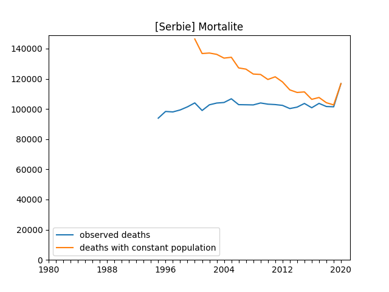

## Suède

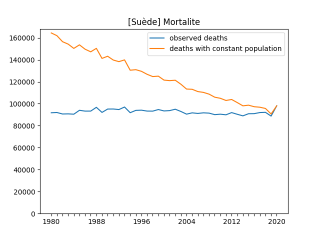

## Slovénie

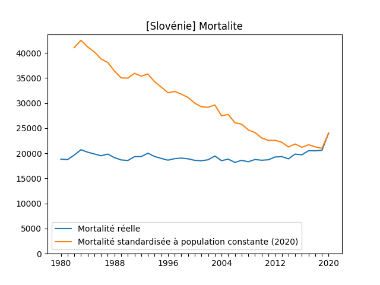

## Slovaquie

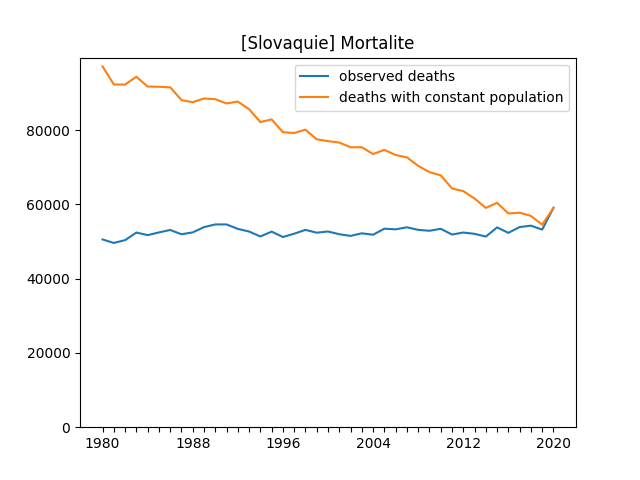

## Turquie

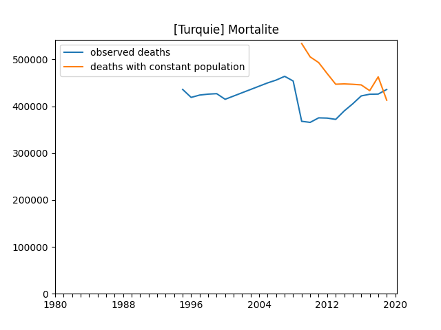

## Ukraine

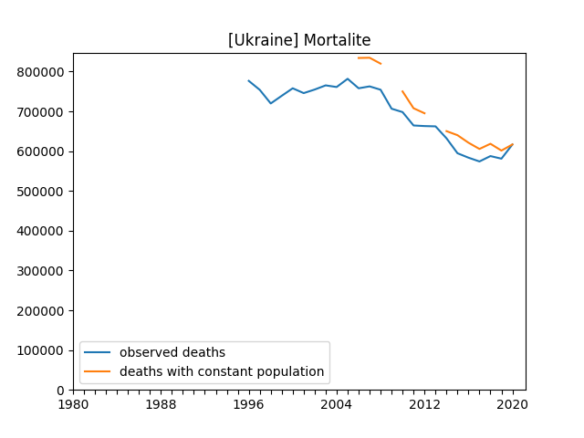

