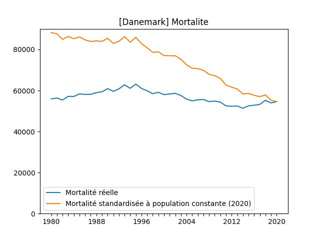
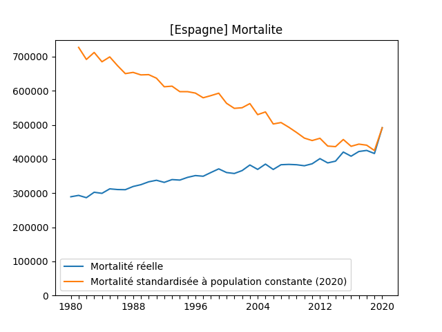
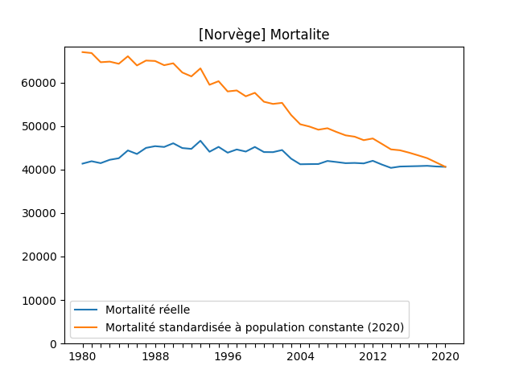
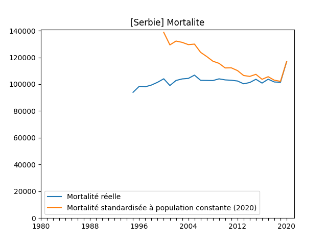
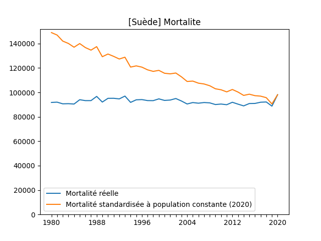
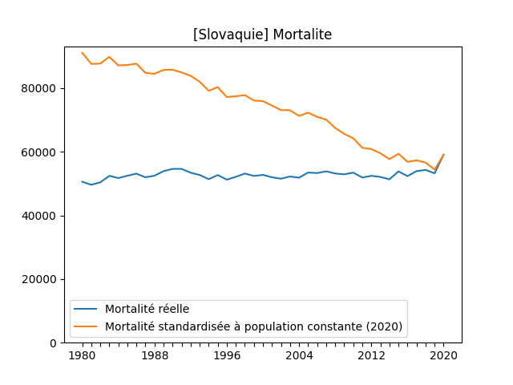

## Autriche

## Azerbaïdjan

## Bulgaria

## Suisse

## Tchéquie

## Allemagne

## Danemark

## Espagne

## France

## Finlande

## Croatie

## Hongrie

## Irlande

## Italie

## Lituanie

## Lettonie

## Macédoine du Nord

## Pays-Bas

## Norvège

## Pologne

## Portugal

## Roumanie

## Serbie

## Suède

## Slovénie

## Slovaquie

## Turquie

## Ukraine

