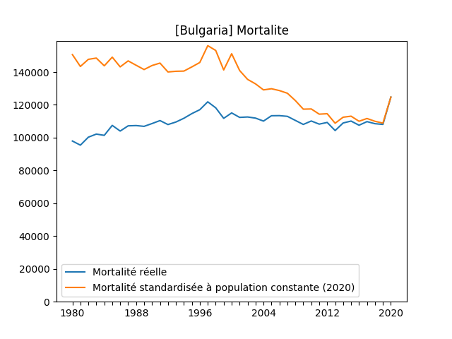
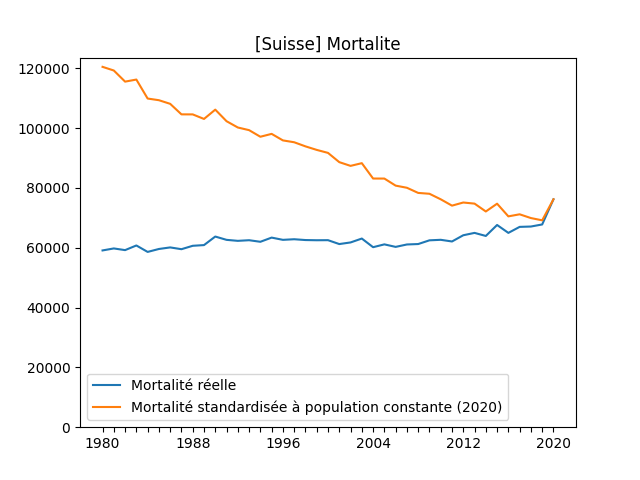
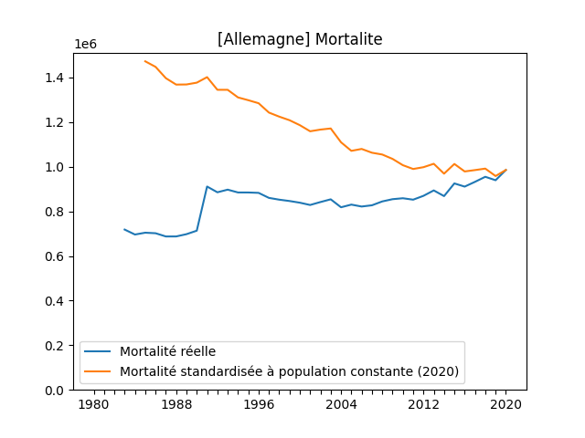
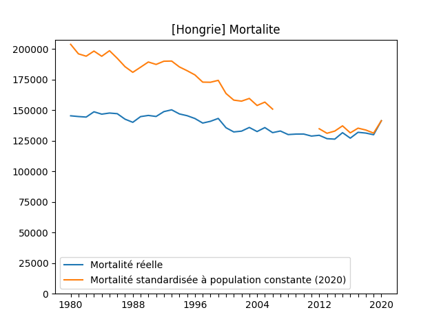
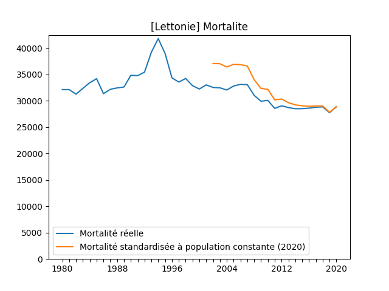
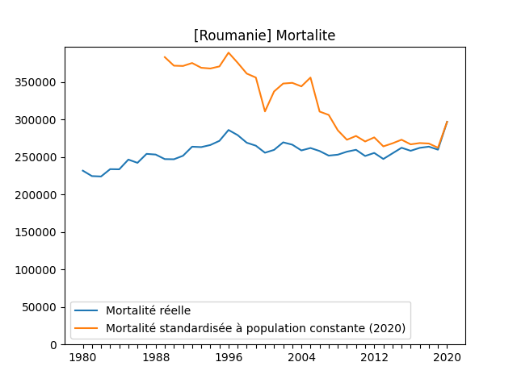
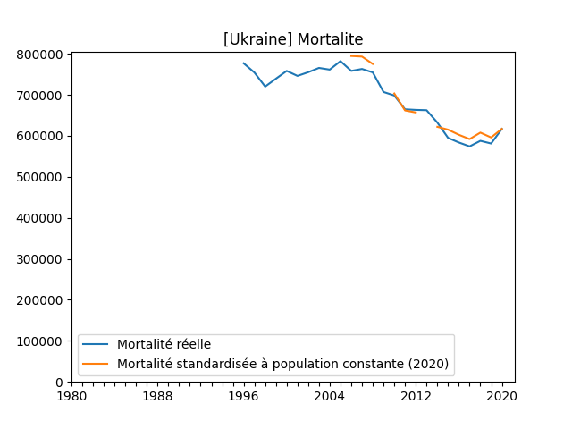

Ceci est un programme open source visant à estimer la dangerosité du covid en comparant la mortalité de l'année 2020 par rapport aux années précédentes.

Ce programme est basé sur des données tirées de Eurostat.

Etant donné que les populations évoluent (et dans la plupart des cas, en Europe, vieillissent), leurs mortalités évoluent également.
Pour donc pleinement évaluer l'exceptionnel gravité de l'année 2020 en terme de mortalité, il faut reculaculer (standardiser) la mortalité de chaque année sur la base d'une population constante.
Ici c'est l'année 2020 qui est pris comme année de référence pour ce calcul.

## Albanie

## Arménie

## Autriche

## Azerbaïdjan

## Bulgaria

## Suisse

## Tchéquie

## Allemagne

## Danemark

## Espagne

## France

## Finlande

## Géorgie

## Croatie

## Hongrie

## Irlande

## Italie

## Lituanie

## Lettonie

## Moldavie

## Macédoine du Nord

## Pays-Bas

## Norvège

## Pologne

## Portugal

## Roumanie

## Serbie

## Russie

## Suède

## Slovénie

## Slovaquie

## Turquie

## Ukraine

## Royaume-Uni

## Kosovo

